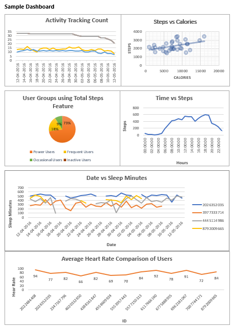

# Bellabeat Fitness Tracker Data Analysis using Excel
## About this Case Study
This case study is part of [Google Data Analytics Capstone:Complete a Case Study](https://www.coursera.org/learn/google-data-analytics-capstone/) under [**Google Data Analytics Professional Certificate**](https://www.coursera.org/professional-certificates/google-data-analytics) course on Coursera.
## Introduction
Bellabeat is a high-tech company founded in 2013 by Urška Sršen and Sando Mur, focused on creating beautifully designed, health-focused smart products for women. With a mission to empower women through technology, Bellabeat provides innovative products that track activity, sleep, stress, and reproductive health, helping users better understand their wellness habits. Their product line includes the Leaf wellness tracker, the Time smart watch, and the Spring smart water bottle, all of which connect to the Bellabeat app. Bellabeat also offers a subscription-based membership that provides personalized guidance on nutrition, activity, and mindfulness. Over the years, Bellabeat has expanded globally and positioned itself as a leader in the women's wellness tech space. The company leverages both traditional and digital marketing channels, with a strong emphasis on data-driven growth strategies.

## Business Task
### Objective:
As a junior data analyst at Bellabeat, I was tasked with analyzing smart device usage data to provide insights into how consumers use non-Bellabeat smart devices. This analysis aims to help Bellabeat’s executive team better understand trends in smart device usage and apply those insights to one of Bellabeat’s products, influencing future marketing strategies. The analysis will focus on identifying trends in /consumer habits from the Fitbit Tracker Dataset and presenting actionable recommendations.

### Skills Used in Excel
- Formating
- Conditional Formating
- Data Cleaning
- Sorting and Filtering
- Power Query - Merging/Joining tables, Group By
- Pivot Tables 
- Data Visualization - Charts and Graphs
- Formulas (COUNTIFS, UNIQUE)

### Skills Used in Sql Server
- Importing Flat files
- Retrieving data from a table
- Updating data in a table
- Data type conversion
- Splitting a column into multiple columns
- Aggregate Functions - Avg, Count
- Functions - Left, Substring, Cast, Charindex, Concat
- Order By, Group By, Having Clauses
- Finding and deleting duplicate rows

## Dashboard Sample

### Connect with Me

- [**LinkedIn**](https://www.linkedin.com/in/anil-jain-bgt/)
